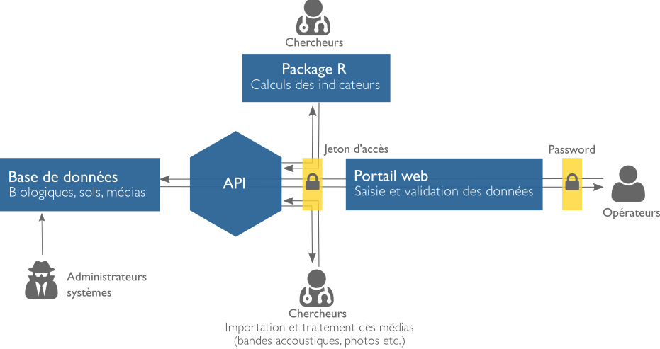
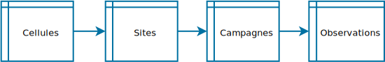

```{r dsetup, results = "hide", echo = FALSE, message = FALSE}
knitr::opts_chunk$set(
  fig.align='center',
  tidy=FALSE,
  size = 'tiny'
)

## Chargement du paquet en local
library(devtools)
load_all("../coleo/rcoleo")
```

# `rcoleo` </br> Livrable 1 - 30 Novembre

## Une première pierre { .vcenter .flexbox }

<div class="columns-2">


- `rcoleo`: Première composante d'une suite d'outils intégrés au système d'information sur la biodiversité Coléo
- Une **librairie R** comprenant un ensemble de fonctionnalitées destiné au forage et à l'analyse de données.

## Objectifs du paquet { .vcenter .flexbox }

**Date:** Décembre 2017

0. Injecter les données BdQc déja récoltées 2016-2017 (en cours)
1. Accéder aux données internes du programme BdQc (en cours)

## Objectifs du paquet { .vcenter .flexbox }

**Date:** Janvier 2017

2. Accéder aux sources de données externes mais **centralisées** (Livrable 3: Arrimage sous tables flottantes)
    - IFA, DRF, Benthos etc..
    - Nécessaires aux calculs des indicateurs
3. Accéder aux sources de données externes mais **décentralisées** (Livrable 2: Tableau de bord)
    - exemple avec GBIF
4. Calculer les indicateurs (à déterminer)

<!-- ???
Notes:

- **Toutes les données centralisées** se retrouvent physiquement dans le SIB (Coléo) à travers des Tables flottantes
- Les fonctionnalitées du paquet R -->

# Installation du paquet

## Procédure d'installation

<div class="columns-2">


### Open Source

- Le code est accessible depuis **Github** (Plateforme de développement Open Source)
- [Adresse du dépôt](https://github.com/TheoreticalEcosystemEcology/rcoleo)

### Installation par ligne de commande

```{r, eval=FALSE}
devtools::install_github(
  "TheoreticalEcosystemEcology/rcoleo"
)
```

</div>

## Sécurité des données



- Les données sont dans la base de données
- Les fonctions du paquet n'ont pas accès aux données sans que l'utilisateur soit authentifié et autorisé.

## Sécurité des données

### Exemple de jeton d'acces

```{r, eval=FALSE}
(bearer <- readRDS("../coleo/rcoleo/.httr-oauth"))
```
Le jeton appartient à une personne ou une application et peut être révoqué à tout moment

### Stratégies

1. Fichier contenant le jeton d'accès (plus rien à faire après, configuration local).
2. Passer le jeton d'accès à la fonction:

```r
sites <- getSites(ids=c("114_111_H01"),token="ebc3bbdc77f647d296fb221830e85309")
```

# Injection des données

## Retour sur la structure de la base de données { .vcenter .flexbox }




## Format des données d'entrées

```{r}
jsonlite::toJSON(cells[1],pretty=TRUE,auto_unbox=TRUE)
```

### Note: le paquet doit être chargé dans l'environnement de R `library(rcoleo)`

## Ajout des données de cellules

```{r}
# On charge un jeux de données test depuis l'intérieur du paquet
data(cells)
# Nombre de cellules total
length(cells)
# On retient seulement les cellules possédant un nom
cells <- cells[which(!is.na(sapply(cells,function(x) x$name)))]
length(cells)
# On ajoute les cellules à la base de données
reponses <- postCells(cells)
```
<!--
Ce qui nous interresse, c'est plus qu'un utilisateur puisse retirer cette donnée -->

## La réponse

### Les codes HTTPs permettent de discerner le type de réponse

```{r, eval=FALSE}
# On ajoute les cellules à la base de données
reponses <- postCells(cells)
```

```{r}
httr::http_status(reponses[[1]]$response)
```

## La réponse

### L'API nous facilite le travail en validant l'information

```{r}
# On duplique une entrée
reponses <- postCells(cells[1])
reponses[[1]]$body
```

## Les fonctions

### Les fonctions permettant l'ajout des données

- `postCells(data)`: Ajouter des cellules
- `postSite(idCell="114_111",data=data)` ou `postSite(data=data)` : Attacher des sites à une cellule
- `postCampaigns(idSite="114_111_H01",data=data)`: Attacher des campagnes à un site
- `postObservations(idCampaign="3",data=data)`: Attacher des observations à un site
- `postMedia(idCampaign="3",data=data)`: Attacher des médias à une campagne (exemple. fichier accourstiques)

# Le retrait des données

## Exemple de retrait de données

```{r, eval=TRUE, echo=FALSE}
source("proto.r")
```

```{r}
reponses <- postSites(sites_ls)
head(getSites())
```

## Exemple avec le retrait des codes d'espèces

```{r}
head(getSpecies())
```

## Les fonctions

### Les fonctions permettant l'ajout des données

- `getCells()`: Obtenir des cellules
- `getSites()`: Obtenir tous les sites
- `getCampaigns()`: Obtenir toutes les campagnes
- `getObservations()`: Obtenir toutes les observations
- `getMedia(idCampaign="3")`: Télécharger les médias rattachés à une campagne depuis le serveur
-
# Fonctionnalitées à venir

## Pour le premier livrable du 30 novembre:

- Améliorer les filtres pour les fonctions de retrait des données (`getSites()`)
- Se rendre jusqu'aux observations (Voir le schéma précédents de la base de données) pour le retrait des données
- Fournir un meilleur gabarit à Caroline (Injection par `parser`)
- Écrire une vignette R pour décrire les fonctionnalitées en plus de la documentation inhérente aux fonctions


<!-- ## Obtenir des données depuis les BDs externes (données externes et décentralisé)

```{r}
library(spocc)
library(wellknown)

occurences <- list()

for(i in 1:length(cells)) occurences[[i]] <- occ(query=NULL,geometry=geojson2wkt(cells[[i]]$shp))

```

# Contrôle sur la qualité

## Espèces de références

## Données validées versus invalidées

# Exemple d'extraction des données


# Supplément: Indicateurs et Cartographie -->
